# User Flow — Haxis Phase 1 MVP (AI-Powered)

## Overview

This user flow maps the navigation structure for Haxis Phase 1 MVP, emphasizing **AI-powered trust, intelligent discovery, and automated assistance** throughout the user journey. Key AI touchpoints include proactive property matching, real-time fraud detection, conversational AI assistance, and smart communication automation.

---

## Complete Navigation Map

```mermaid
graph TD
  %% ============================================
  %% ENTRY POINTS & ONBOARDING
  %% ============================================
  Landing["Landing Page<br/>/"] --> Signup["Sign Up / Login<br/>/auth"]
  Signup --> RoleSelection["Select Role<br/>/onboarding/role"]

  RoleSelection --> TenantOnboarding["AI Preference Quiz (Tenant)<br/>/onboarding/tenant"]
  RoleSelection --> LandlordOnboarding["Verification Setup (Landlord)<br/>/onboarding/landlord"]
  RoleSelection --> AgentOnboarding["Credentials Setup (Agent)<br/>/onboarding/agent"]

  TenantOnboarding --> TenantDashboard
  LandlordOnboarding --> LandlordDashboard
  AgentOnboarding --> AgentDashboard

  %% ============================================
  %% ROLE-BASED DASHBOARDS
  %% ============================================
  TenantDashboard["🏠 Tenant Dashboard<br/>/dashboard/tenant"]
  LandlordDashboard["📊 Landlord Dashboard<br/>/dashboard/landlord"]
  AgentDashboard["💼 Agent Dashboard<br/>/dashboard/agent"]

  %% ============================================
  %% TENANT JOURNEY (AI-ENHANCED)
  %% ============================================
  subgraph "🎯 AI-Powered Discovery (Tenant)"
    TenantDashboard --> BestMatches["Best Matches (AI)<br/>/dashboard/tenant/matches"]
    TenantDashboard --> Search["Search Properties<br/>/search"]
    TenantDashboard --> SavedProperties["Saved Properties<br/>/dashboard/tenant/saved"]
    TenantDashboard --> AIInsights["AI Insights Panel<br/>/dashboard/tenant/insights"]

    BestMatches --> PropertyDetail["Property Detail<br/>/property/:id"]
    Search --> PropertyDetail
    SavedProperties --> PropertyDetail

    PropertyDetail --> AIComparison["AI Property Comparison<br/>/compare"]
    PropertyDetail --> AIAssistantQuery["Ask AI Assistant<br/>/assistant?context=property"]
  end

  subgraph "💬 AI-Protected Communication (Tenant)"
    PropertyDetail --> ChatInit["Initiate Chat<br/>/chat/new"]
    ChatInit --> AITrustCheck["AI Trust Score Check"]
    AITrustCheck --> Chat["InChat Conversation<br/>/chat/:conversationId"]
    Chat --> AIScamDetection["Real-Time Scam Detection"]
    Chat --> SmartReply["AI Smart Reply Suggestions"]
  end

  subgraph "💰 AI Payment Intelligence (Tenant)"
    TenantDashboard --> Utilities["Utilities & Payments<br/>/dashboard/tenant/utilities"]
    Utilities --> BillPrediction["AI Bill Predictions<br/>/utilities/predictions"]
    Utilities --> PayElectricity["Pay Electricity<br/>/utilities/electricity/pay"]
    Utilities --> PayWater["Pay Water<br/>/utilities/water/pay"]
    Utilities --> PayTV["Pay TV Subscription<br/>/utilities/tv/pay"]
    Utilities --> AnomalyAlert["AI Anomaly Detection"]

    PayElectricity --> PaymentConfirmation["Payment Confirmation<br/>/utilities/confirmation/:id"]
    PayWater --> PaymentConfirmation
    PayTV --> PaymentConfirmation

    PaymentConfirmation --> SpendingInsights["AI Spending Insights<br/>/utilities/insights"]
  end

  subgraph "📈 Tenant AI Analytics"
    AIInsights --> BudgetHealth["Budget Health Score"]
    AIInsights --> AffordabilityMap["Affordability Map"]
    AIInsights --> SavingsProgress["Savings Goal Tracking"]
    AIInsights --> RentTrends["Rent Trend Forecasts"]
  end

  %% ============================================
  %% LANDLORD JOURNEY (AI-ENHANCED)
  %% ============================================
  subgraph "🏗️ AI-Assisted Listing Creation (Landlord)"
    LandlordDashboard --> CreateListing["Create Property Listing<br/>/property/create"]
    CreateListing --> AIDescriptionGen["AI Description Generator"]
    CreateListing --> PhotoCoaching["AI Photo Coaching"]
    CreateListing --> PricingIntel["AI Pricing Intelligence"]
    CreateListing --> PrePublishScore["AI Pre-Publish Score"]
    PrePublishScore --> ListingPreview["Listing Preview<br/>/property/preview/:id"]
    ListingPreview --> AIVerification["AI Automated Verification"]
    AIVerification --> PublishedListing["Published Listing"]
  end

  subgraph "📊 AI Landlord Analytics"
    LandlordDashboard --> PerformanceDash["Performance Dashboard<br/>/dashboard/landlord/analytics"]
    PerformanceDash --> DemandScore["Area Demand Score"]
    PerformanceDash --> CompetitiveAnalysis["AI Competitive Analysis"]
    PerformanceDash --> PriceOptimization["Price Optimization Tool"]
    PerformanceDash --> ConversionFunnel["Conversion Funnel Analytics"]
  end

  subgraph "🔔 AI Lead Management (Landlord)"
    LandlordDashboard --> InquiryQueue["Inquiry Queue<br/>/dashboard/landlord/inquiries"]
    InquiryQueue --> AILeadScoring["AI Lead Quality Scoring"]
    AILeadScoring --> PrioritizedInbox["Prioritized Inbox (🔥⚡❄️)"]
    PrioritizedInbox --> Chat
    Chat --> AISmartReplies["AI Smart Reply Options"]
    Chat --> AutoResponse["AI Auto-Response (Opt-In)"]
  end

  subgraph "🏘️ Landlord Management"
    LandlordDashboard --> ManageListings["Manage Listings<br/>/dashboard/landlord/properties"]
    LandlordDashboard --> PublicProfile["Public Landlord Profile<br/>/profile/:landlordId"]
    LandlordDashboard --> PaymentTracking["Payment Tracking<br/>/dashboard/landlord/payments"]

    ManageListings --> PropertyDetail
    ManageListings --> EditListing["Edit Listing<br/>/property/edit/:id"]
    EditListing --> AIReoptimize["AI Re-Optimization Suggestions"]

    PaymentTracking --> AIPredictPayment["AI Payment Predictions"]
    PaymentTracking --> TenantReliability["Tenant Reliability Scores"]
  end

  %% ============================================
  %% AGENT JOURNEY (AI-ENHANCED)
  %% ============================================
  subgraph "🎯 AI Lead Intelligence (Agent)"
    AgentDashboard --> LeadHub["AI Lead Management Hub<br/>/dashboard/agent/leads"]
    LeadHub --> LeadScoring["AI Lead Quality Scoring"]
    LeadScoring --> HotLeads["🔥 Hot Leads (80+)"]
    LeadScoring --> WarmLeads["⚡ Warm Leads (50-79)"]
    LeadScoring --> ColdLeads["❄️ Cold Leads (<50)"]

    HotLeads --> Chat
    WarmLeads --> Chat
    ColdLeads --> Chat

    LeadHub --> DecayAlerts["AI Lead Decay Alerts"]
    DecayAlerts --> UrgentFollowUp["Urgent Follow-Up Notifications"]
  end

  subgraph "📈 Agent Performance AI"
    AgentDashboard --> PerformanceBench["Performance Benchmarking<br/>/dashboard/agent/performance"]
    PerformanceBench --> AgentRanking["Agent Ranking (vs. Platform)"]
    PerformanceBench --> ConversionCoaching["AI Conversion Coaching"]
    PerformanceBench --> CommissionForecast["AI Commission Forecasting"]
    PerformanceBench --> MarketIntel["Market Intelligence Alerts"]
  end

  subgraph "🗂️ Agent Portfolio"
    AgentDashboard --> ManageProperties["Manage Properties<br/>/dashboard/agent/properties"]
    AgentDashboard --> AgentProfile["Agent Public Profile<br/>/profile/agent/:agentId"]
    AgentDashboard --> DealPipeline["Deal Pipeline<br/>/dashboard/agent/pipeline"]

    ManageProperties --> CreateListingAgent["Create Property Listing<br/>/property/create"]
    CreateListingAgent --> AIDescriptionGen

    DealPipeline --> AIClosureProbability["AI Closure Probability"]
    DealPipeline --> InspectionScheduler["Inspection Scheduler"]
  end

  %% ============================================
  %% AI ASSISTANT (GLOBAL)
  %% ============================================
  subgraph "🤖 AI Assistant (Always Accessible)"
    AIAssistant["AI Assistant Chat<br/>/assistant"]

    AIAssistant --> NLSearch["Natural Language Search"]
    AIAssistant --> ListingExplanation["Listing Explanation"]
    AIAssistant --> PropertyComparison["Property Comparison"]
    AIAssistant --> MessageDrafting["Message Drafting"]
    AIAssistant --> FirstTimerGuide["First-Timer Guidance"]
    AIAssistant --> BillExplanation["Bill Explanation"]
  end

  %% Cross-connections to AI Assistant
  PropertyDetail -.-> AIAssistant
  Chat -.-> AIAssistant
  Utilities -.-> AIAssistant
  CreateListing -.-> AIAssistant
  LeadHub -.-> AIAssistant

  %% ============================================
  %% VERIFICATION & TRUST SYSTEM
  %% ============================================
  subgraph "🛡️ AI Trust & Verification"
    TrustDashboard["Trust Score Dashboard<br/>/trust/:userId"]
    TrustDashboard --> ScoreBreakdown["Score Breakdown"]
    TrustDashboard --> ImproveTips["AI Improvement Tips"]
    TrustDashboard --> VerificationStatus["Verification Status"]

    VerificationUpload["Upload Verification Docs<br/>/verify/upload"]
    VerificationUpload --> AIDocAnalysis["AI Document Analysis"]
    AIDocAnalysis --> FastTrackVerify["Fast-Track Verification (10 min)"]
    FastTrackVerify --> BadgeAwarded["Verification Badge Awarded"]
  end

  %% ============================================
  %% ADMIN (AI-POWERED MODERATION)
  %% ============================================
  subgraph "🔧 Admin Dashboard (AI-Powered)"
    AdminDash["Admin Dashboard<br/>/admin"]
    AdminDash --> AIFraudQueue["AI Fraud Detection Queue<br/>/admin/fraud"]
    AdminDash --> ManualReviewQueue["Manual Review Queue<br/>/admin/review"]
    AdminDash --> PlatformAnalytics["Platform Analytics<br/>/admin/analytics"]
    AdminDash --> UserManagement["User Management<br/>/admin/users"]

    AIFraudQueue --> BlockedListings["Blocked Listings (AI)"]
    AIFraudQueue --> FlaggedUsers["Flagged Users (AI)"]
    AIFraudQueue --> ScamPatterns["AI Scam Pattern Reports"]

    ManualReviewQueue --> EdgeCases["Edge Cases (Human Review)"]
    ManualReviewQueue --> UserAppeals["User Appeals"]
  end

  %% ============================================
  %% CROSS-PAGE NAVIGATION
  %% ============================================
  PropertyDetail --> PublicProfile
  PropertyDetail --> AgentProfile
  Chat --> PropertyDetail
  PublicProfile --> ManageListings
  AgentProfile --> ManageProperties

  %% Global Navigation
  TenantDashboard --> TrustDashboard
  LandlordDashboard --> TrustDashboard
  AgentDashboard --> TrustDashboard

  TenantDashboard --> Chat
  LandlordDashboard --> Chat
  AgentDashboard --> Chat

  %% AI Proactive Notifications (System-Initiated)
  AIProactive["AI Proactive Notifications"] -.->|New Best Match| TenantDashboard
  AIProactive -.->|Hot Lead Alert| AgentDashboard
  AIProactive -.->|Price Drop Alert| TenantDashboard
  AIProactive -.->|Payment Reminder| Utilities
  AIProactive -.->|Scam Warning| Chat
```



---

## Page Descriptions & AI Features

### 🏠 **Tenant Dashboard** `/dashboard/tenant`
**AI Features:**
- **Best Matches Section**: Top 3 AI-recommended properties with match % (e.g., "94% Match")
- **AI Insights Panel**: Budget health score, spending breakdown, bill predictions
- **Proactive Alerts**: New matches, price drops, rent trend warnings
- **Personalized Feed**: AI-ranked property cards based on browsing behavior

**Navigation:**
- Quick access to: Best Matches, Search, Saved Properties, Utilities, AI Insights
- Floating AI Assistant icon (always visible)

---

### 📊 **Landlord Dashboard** `/dashboard/landlord`
**AI Features:**
- **Performance Indicators**: "High Demand" badges, predicted inquiry rates
- **Pre-Publish AI Score**: Before listings go live (0-100 score)
- **Lead Prioritization**: Inquiries ranked by AI quality score (🔥⚡❄️)
- **Market Intelligence**: Area demand score, competitive analysis, price optimization

**Navigation:**
- Quick access to: Create Listing, Manage Listings, Inquiries, Analytics, Public Profile
- AI Smart Reply visible in inbox

---

### 💼 **Agent Dashboard** `/dashboard/agent`
**AI Features:**
- **AI Lead Management Hub**: Prioritized inquiry queue with conversion probability
- **Performance Benchmarking**: Rank vs. other agents, improvement suggestions
- **Lead Decay Alerts**: "Contact within 2 hours to prevent losing to competitors"
- **Commission Forecasting**: "Based on current pipeline, projected ₦450k this month"

**Navigation:**
- Quick access to: Lead Hub, Properties, Pipeline, Performance, Profile
- AI coaching tips prominent

---

### 🏘️ **Property Detail** `/property/:id`
**AI Features:**
- **Trust Score Display**: Landlord trust score with color-coded badge (🟢🟡🔴)
- **AI Match Explanation**: "92% Match: Perfect budget + trusted landlord + available now"
- **Pre-Chat AI Check**: Shows landlord trust breakdown before opening chat
- **Quick AI Queries**: "Is parking included?" button (AI scans listing instantly)
- **Comparison Tool**: "Compare with saved properties" (AI side-by-side analysis)

**Key Elements:**
- Photos, description, pricing, amenities, location map
- "AI-Protected" verification badge
- "Ask AI Assistant" floating button
- "Contact Landlord" (triggers trust check first)

---

### 💬 **InChat Conversation** `/chat/:conversationId`
**AI Features:**
- **Real-Time Scam Detection**: Messages held/blocked if high-risk patterns detected
- **Smart Reply Suggestions**: Context-aware quick replies (one-tap send)
- **AI-Generated Responses**: Landlords/agents can enable auto-response for routine questions
- **Conversation Summaries**: Auto-generated after 20+ messages
- **Language Translation**: Cross-language chat support (Phase 3)
- **Trust Indicators**: User trust scores visible in chat header

**Interface:**
- WhatsApp-style chat bubbles
- AI suggestion chips above keyboard
- Warning banners for suspicious messages
- "View Summary" button in header

---

### 🤖 **AI Assistant Chat** `/assistant`
**Always Accessible via Floating Icon**

**Capabilities:**
- **For Tenants**: Natural language search, listing explanation, property comparison, message drafting, first-timer guidance, bill explanation
- **For Landlords**: Description generator, photo coaching, pricing intelligence, tenant screening, response urgency alerts
- **For Agents**: Lead prioritization, response templates, performance coaching

**Interface:**
- Conversational chat interface
- Voice + text input
- "Why am I seeing this?" transparency tooltips
- Feedback buttons (Helpful / Not relevant)

---

### 💰 **Utilities & Payments** `/dashboard/tenant/utilities`
**AI Features:**
- **Bill Predictions**: "Your estimated electricity bill next month: ₦18,000 (±₦2,000)"
- **Smart Reminders**: Timed to user's payment behavior (weekend payer → Friday reminder)
- **Anomaly Detection**: "This bill is 140% higher than usual — possible meter issue"
- **Spending Insights**: Pie chart, trend line, comparative analysis
- **Auto-Pay Intelligence**: Only processes if amount within expected range

**Available Payments:**
- Electricity (prepaid/postpaid)
- Water
- TV Subscriptions (DSTV, GOTV, Startimes)
- Internet
- Landlord-defined fees (service charge, generator, security)

---

### 🏗️ **Create Property Listing** `/property/create`
**AI-Assisted Wizard:**

**Step 1: Property Type & Market Context**
- Select type (Rent/Sale/Shortlet)
- AI shows: "2-bedroom apartments in Ikeja have 88/100 demand score (High)"

**Step 2: Photo Upload with AI Coaching**
- AI analyzes each photo: "✓ Great lighting (95%)" or "⚠️ Too dark — retake for 25% more engagement"
- Missing photo alerts: "Add kitchen photo — listings with kitchens get 35% more inquiries"

**Step 3: Details + AI Description Generator**
- User inputs: Beds, baths, size, amenities
- AI drafts professional description
- Tone adjustments: "Make more casual" / "Emphasize security"

**Step 4: Pricing with AI Intelligence**
- User enters desired price
- AI analysis: "₦850k is 15% above market — expect 3-5 inquiries/week"
- Revenue comparison: "₦800k fills in 2 weeks vs. ₦850k in 6 weeks"

**Step 5: Pre-Publish AI Score**
- Overall score: 87/100
- Breakdown: Photos (92), Description (90), Pricing (78)
- Suggestions: "Add video tour for 95/100 score"

**Step 6: Automated Verification**
- AI document analysis (OCR + forgery detection)
- Fast-track verification: 8 minutes vs. 24-48 hours
- Listing goes live with full verification badge

---

### 📈 **AI Analytics Dashboards**

**Tenant AI Insights** `/dashboard/tenant/insights`
- Budget Health Score (color-coded: Green/Yellow/Red)
- Spending patterns (monthly trend graph)
- Affordability Map (heatmap with commute overlay)
- Savings goal tracking ("18 months to goal at current pace")
- Rent trend forecasts ("Rents in your area expected +5% next quarter")

**Landlord Performance Dashboard** `/dashboard/landlord/analytics`
- Listing performance prediction (inquiry rate forecast)
- Area demand score (0-100 with trend arrows)
- Competitive analysis ("You rank #3 of 8 similar properties")
- Price optimization tool (revenue scenarios)
- Conversion funnel (View → Inquiry → Inspection → Lease)

**Agent Performance Benchmarking** `/dashboard/agent/performance`
- Agent ranking ("#23 of 150 agents — Top 15%")
- Response time vs. top 10%
- Conversion rate vs. platform average
- Commission forecasting ("Projected ₦450k this month")
- Market intelligence alerts ("High demand for 1-bed in Ikeja")

---

### 🛡️ **Trust Score Dashboard** `/trust/:userId`
**User-Facing Transparency:**

**Score Display:**
- Large trust score number (0-100)
- Color-coded badge (🟢 High 80-100, 🟡 Medium 50-79, 🔴 Low <50)
- Tier label ("High Trust")

**Breakdown:**
- Identity Verification (30%): KYC completion, document authenticity
- Platform Behavior (40%): Payment reliability, communication quality
- External Signals (15%): Phone legitimacy, social media validation
- Network Analysis (15%): Connections to verified users

**AI Improvement Tips:**
- "Complete property verification for +10 points"
- "6 months on-time payments unlocks High Trust tier"
- "Connect social media for +5 points"

**Gamification:**
- Badges displayed: "Always On Time", "Verified Landlord", "Community Helper"
- Streaks tracker (payment streaks, response streaks)
- Next milestone progress bar

---

### 🔧 **Admin Dashboard (AI-Powered)** `/admin`

**AI Fraud Detection Queue** `/admin/fraud`
- Blocked listings (AI auto-blocked, never seen by users)
- Flagged users (suspicious behavior detected)
- Scam pattern reports (emerging fraud types)
- Evidence summaries for each case

**Manual Review Queue** `/admin/review`
- Edge cases (50-79 AI risk score, requires human judgment)
- User appeals (contest AI decisions)
- Verification challenges (document unclear to AI)

**Platform Analytics** `/admin/analytics`
- Trust metrics: Fraud detection rate, false positive rate, avg trust score
- AI performance: Recommendation CTR, assistant adoption, scam intervention rate
- User growth: Acquisition, retention, engagement
- Transaction health: GMV, completion rate, dispute rate

**User Management** `/admin/users`
- Search users by trust score, verification status
- View full AI reports for any user
- Override AI decisions (with audit trail)
- Ban/suspend accounts with reasoning

---

## AI-Powered Flows Summary

### Flow 1: AI-Guided Property Discovery (Tenant)
```
App Open → Best Matches (AI) → View Property → Ask AI Questions →
Compare with Saved (AI) → Trust Check → Chat (AI Protected) →
Schedule Inspection → Close Deal
```

### Flow 2: AI-Assisted Listing Creation (Landlord)
```
Create Listing → AI Market Context → Upload Photos (AI Coaching) →
AI Description Generator → AI Pricing Intelligence → Pre-Publish Score →
AI Verification (8 min) → Published with Badge → Receive Prioritized Inquiries
```

### Flow 3: AI Lead Management (Agent)
```
Open Dashboard → AI Prioritized Leads (🔥⚡❄️) → View Hot Lead Context →
AI Smart Reply (One-Tap) → Lead Decay Alert → Follow Up →
AI Closure Probability → Close Deal → Commission Forecast Updated
```

### Flow 4: AI Payment Intelligence (Tenant)
```
AI Smart Reminder (Timed to Behavior) → Open Utilities → See Predicted Bill →
Anomaly Alert (if unusual) → One-Tap Payment → Digital Receipt Auto-Posted to Chat →
Spending Insights Dashboard → Next Bill Prediction
```

### Flow 5: AI Fraud Prevention (System)
```
Scammer Uploads Listing → AI Image Analysis (Stock Photos Detected) →
AI Content Scan (Scam Keywords) → AI Risk Score (92/100 Critical) →
Auto-Block (Never Visible to Users) → Admin Alert →
User Protection (Browse with Confidence)
```

---

## Navigation Hierarchy

### Primary Navigation (All Roles)
- Dashboard (role-specific)
- Search / Browse
- Chat / Messages
- Profile
- AI Assistant (floating icon)

### Tenant-Specific
- Best Matches (AI)
- Saved Properties
- Utilities & Payments
- AI Insights

### Landlord-Specific
- Create Listing (AI-Assisted)
- Manage Listings
- Inquiry Queue (AI-Prioritized)
- Performance Analytics (AI)
- Public Profile

### Agent-Specific
- Lead Hub (AI-Scored)
- Properties
- Deal Pipeline (AI Probability)
- Performance Benchmarking (AI)
- Agent Profile

### Admin-Specific
- Fraud Detection Queue (AI)
- Manual Review Queue
- Platform Analytics
- User Management

---

## AI Touchpoints Across Platform

| Page | AI Feature | User Benefit |
|------|-----------|--------------|
| **Tenant Dashboard** | Best Matches (Top 3) | 80% faster discovery |
| **Property Detail** | Trust Score Display | Scam prevention |
| **Chat** | Real-Time Scam Detection | Fraud protection |
| **Chat** | Smart Reply Suggestions | 50% faster responses |
| **Utilities** | Bill Prediction | No surprise charges |
| **Utilities** | Anomaly Detection | Overbilling protection |
| **Create Listing** | Description Generator | Professional listings in minutes |
| **Create Listing** | Pricing Intelligence | Optimal market positioning |
| **Create Listing** | Pre-Publish Score | Quality assurance before live |
| **Landlord Dashboard** | Lead Prioritization | Focus on best prospects |
| **Landlord Dashboard** | Demand Score | Market timing insights |
| **Agent Dashboard** | Lead Scoring | 3x faster deal closure |
| **Agent Dashboard** | Decay Alerts | Never lose hot leads |
| **Agent Dashboard** | Commission Forecast | Financial planning |
| **Trust Dashboard** | Improvement Tips | Gamified trust building |
| **Admin Dashboard** | Auto-Fraud Blocking | 95% scams prevented |
| **AI Assistant** | 24/7 Guidance | Zero wait time support |

---

## Technical Notes

**AI Model Integration Points:**
- Trust scoring: Real-time calculation on every user action
- Recommendations: Nightly batch pre-computation, Redis cache
- Scam detection: Real-time NLP inference (<500ms latency)
- Image verification: AWS Lambda GPU inference (<2 sec)
- Bill prediction: Time series models, weekly retraining

**Performance Targets:**
- Page load: <2 seconds (excluding AI features)
- AI inference: <2 seconds (user-facing)
- Search results: <500ms
- Chat message delivery: <100ms
- AI smart reply generation: <1 second

**Mobile-First Design:**
- All AI features optimized for mobile screens
- Floating AI Assistant accessible via bottom-right icon
- One-tap interactions for AI suggestions
- Haptic feedback on AI interventions (scam warnings)

---

**Document Version:** 2.0 (AI-Powered)
**Last Updated:** February 21, 2026
**Status:** Phase 1 MVP Specification
**Related Documents:** PRD v2.0, Product Charter v2.0

**End of User Flow**
